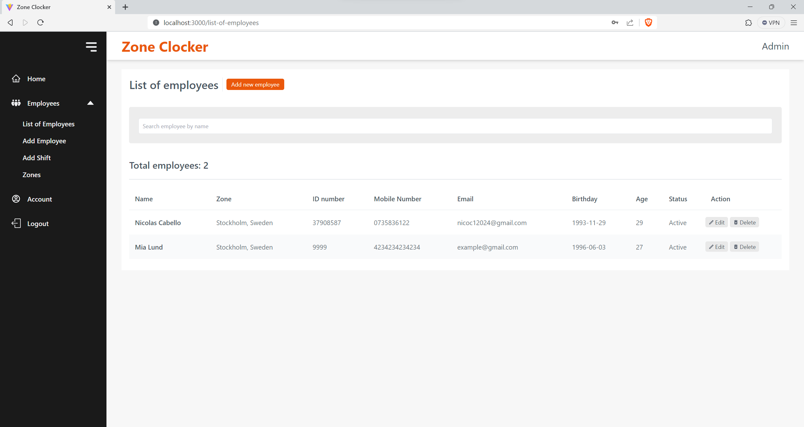
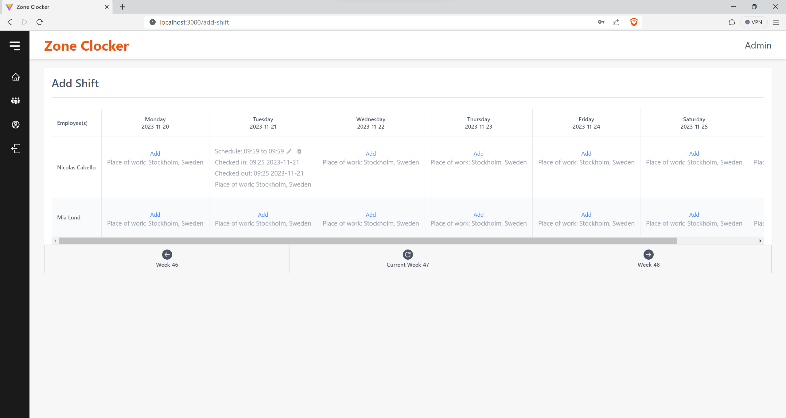
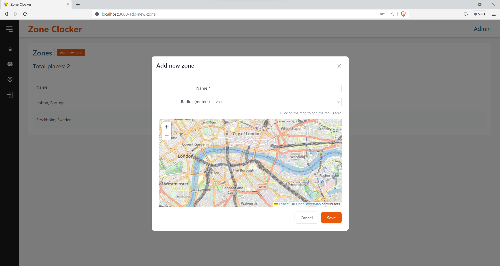
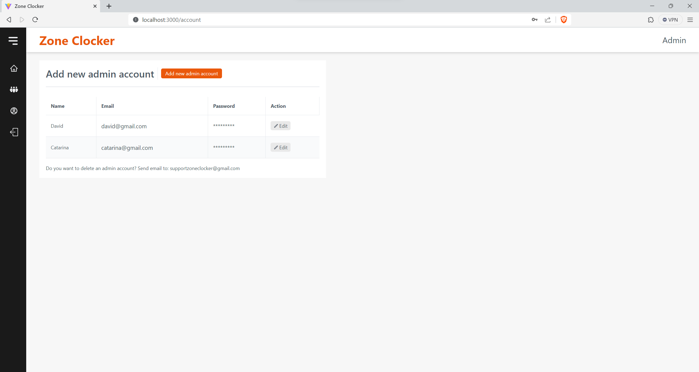
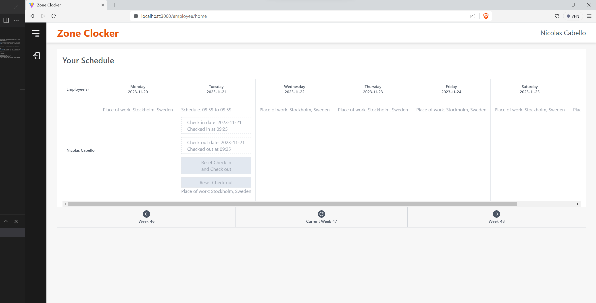

# Zone Clocker: Employee Schedule and Work Zone Management App

**Platform**: Full Stack (Node.js, Express.js, React with Vite, TypeScript, MySQL)

**Target Users**: Companies and Organizations

## Core Functionality

Zone Clocker full-stack application designed to streamline employee schedule management and work zone assignments for companies. It provides a centralized platform for admins to manage employee schedules and work zones, with a focus on time tracking and location-based check-ins and check-outs.

## Key Features

1. **Company Account Creation**: Organizations can create their own accounts, serving as the administrative hub for managing employees and work zones.

2. **Employee Management**: Admins can add employees by inputting essential details like name and ID number, with additional optional information.

3. **Work Zone Creation and Assignment**:

   - Admins can define work zones using a map interface, selecting specific areas and setting radio to mark designated workspaces.
   - Employees are assigned to these zones, and their check-ins and check-outs are only valid when done within these designated areas.

4. **Time Tracking and Calendar Integration**: Both employees and admins can track check-in and check-out times via an intuitive calendar interface.

5. **Scheduling and Real-time Updates**: Admins can set schedules for each employee and receive real-time updates on employee check-ins and checkouts.

6. **Employee Editing and Searching**: Admins have the capability to edit, create, and delete employee records. They can also search for employees or work zones by name.

7. **Admin Account Management**: Ability to create additional admin accounts and manage them effectively.

8. **Simplified Employee Login**: Employees log in using their assigned ID numbers (no passwords required), accessing their schedules and checking in or out as needed.

9. **Admin Login**: http://localhost:3000/login

10. **Employee Login**: http://localhost:3000/login-employee

## Demo

